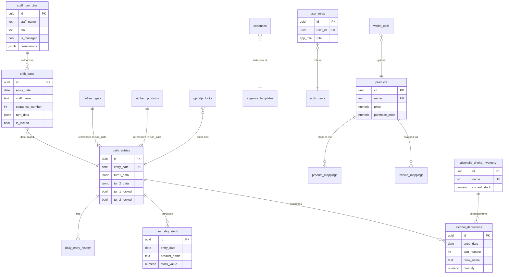

# README 2 — Inventar Boulevard (Thellim Teknik)

Ky dokument plotëson `README.md` me detaje operacionale: RLS, variablat e mjedisit, skema e DB me diagram, migrime hap-pas-hapi dhe shembuj konkretë për çdo edge function.

---

## 1. 🔒 Rregullat RLS (Row Level Security)

Të gjitha tabelat në schemën `public` kanë RLS të aktivizuar. Modeli i sigurisë ndjek këto parime:

- **Anon Auth**: staf hyn me `supabase.auth.signInAnonymously()` → merr një `auth.uid()` të vlefshëm.
- **Admin**: hyn me email/password + rol në `user_roles` (`app_role='admin'`) i kontrolluar me `has_role(auth.uid(), 'admin')`.
- **Roles në tabelë të veçantë** (`user_roles`) — kurrë në `profiles` (parandalon privilege escalation).
- **`service_role`** përdoret vetëm nga edge functions server-side.

### 1.1 Modeli standard për tabelat operacionale

Për tabelat si `daily_entries`, `shift_turns`, `products`, `expenses`, `alcoholic_drinks_inventory`, etj., politikat janë:

```sql
-- SELECT: çdo përdorues i autentikuar (anon ose admin)
CREATE POLICY "authenticated_read" ON public.<table>
  FOR SELECT TO authenticated
  USING (true);

-- INSERT / UPDATE / DELETE: çdo përdorues i autentikuar
CREATE POLICY "authenticated_write" ON public.<table>
  FOR ALL TO authenticated
  USING (true) WITH CHECK (true);

-- Service role: qasje e plotë për edge functions
CREATE POLICY "service_role_all" ON public.<table>
  FOR ALL TO service_role
  USING (true) WITH CHECK (true);
```

> **Pse jo `auth.uid() = user_id`?** Sepse aplikacioni është multi-user për një lokal të vetëm — të gjithë staf-i sheh të njëjtat të dhëna operacionale. Ndarja bëhet me `staff_name` (jo me `user_id`).

### 1.2 Rasti i `shift_turns`

Tabela `shift_turns` përmban turne fleksibël (jo vetëm T1/T2). Politikat:

```sql
GRANT SELECT, INSERT, UPDATE, DELETE ON public.shift_turns TO authenticated;
GRANT ALL ON public.shift_turns TO service_role;
ALTER TABLE public.shift_turns ENABLE ROW LEVEL SECURITY;

CREATE POLICY "shift_turns_auth_read"
  ON public.shift_turns FOR SELECT
  TO authenticated USING (true);

CREATE POLICY "shift_turns_auth_write"
  ON public.shift_turns FOR ALL
  TO authenticated USING (true) WITH CHECK (true);

CREATE POLICY "shift_turns_service"
  ON public.shift_turns FOR ALL
  TO service_role USING (true) WITH CHECK (true);
```

**Pse i lejohet çdo `authenticated` të shkruajë?** Sepse `staff_name` gjurmohet brenda `turn_data` JSONB, dhe kyçja bëhet me `is_locked` + `locked_at`. Për një kufizim më strikt, shto:

```sql
CREATE POLICY "no_write_when_locked" ON public.shift_turns
  FOR UPDATE TO authenticated
  USING (is_locked = false OR public.has_role(auth.uid(), 'admin'));
```

### 1.3 Rasti i `user_roles` dhe `staff_turn_pins`

Këto janë **auth-only** (pa `anon`):

```sql
GRANT SELECT ON public.user_roles TO authenticated;
GRANT ALL   ON public.user_roles TO service_role;

CREATE POLICY "users_read_own_role" ON public.user_roles
  FOR SELECT TO authenticated
  USING (user_id = auth.uid());

CREATE POLICY "admin_manage_roles" ON public.user_roles
  FOR ALL TO authenticated
  USING (public.has_role(auth.uid(), 'admin'))
  WITH CHECK (public.has_role(auth.uid(), 'admin'));
```

PIN-et verifikohen vetëm përmes RPC `verify_staff_pin()` (SECURITY DEFINER) — asnjë klient nuk lexon direkt kolonën `pin`.

### 1.4 Testim lokal i roleve

**A) Test si staf anonim (nga browser DevTools Console te faqja):**
```js
const { data: { user } } = await window.supabase.auth.getUser();
console.log('uid:', user?.id);
const { data, error } = await window.supabase.from('shift_turns').select('*').limit(1);
console.log({ data, error });   // pritet: sukses
```

**B) Test si admin:**
```js
await window.supabase.auth.signInWithPassword({ email: 'admin@x.com', password: '...' });
const { data } = await window.supabase.rpc('has_role', {
  _user_id: (await window.supabase.auth.getUser()).data.user.id,
  _role: 'admin'
});
console.log('is admin:', data);
```

**C) Test negativ (siguri):** provo të lexosh `staff_turn_pins.pin` direkt:
```js
const { data, error } = await window.supabase.from('staff_turn_pins').select('pin');
// pritet: error ose data pa kolonën `pin` në varësi të politikës
```

**D) Verifikim RLS përmes SQL (nga backend):**
```sql
-- Kalo në rol authenticated dhe simulo një user
SET LOCAL ROLE authenticated;
SET LOCAL request.jwt.claim.sub = '<uuid-i-staf-it>';
SELECT * FROM public.shift_turns LIMIT 5;
```

---

## 2. 🔑 Variablat e Mjedisit (Env)

### 2.1 Klienti (Vite / Frontend)

Të gjitha variablat me prefiks `VITE_` bëhen publike në bundle. Ato lexohen me `import.meta.env`.

| Variabla | Vlera | Përdorimi |
|---|---|---|
| `VITE_SUPABASE_URL` | `https://<project>.supabase.co` | URL-ja e projektit |
| `VITE_SUPABASE_PUBLISHABLE_KEY` | anon/publishable JWT | Key publike (RLS mbron të dhënat) |
| `VITE_SUPABASE_PROJECT_ID` | `<project-id>` | ID-ja për referenca |

> **Këto vlera janë PUBLIKE** — publikohen normalisht në bundle. **Mos i fshi para publikimit** — do të kesh faqe boshe.

### 2.2 Serveri (Edge Functions / Deno)

Këto janë **sekret**, të disponueshme vetëm në edge functions:

| Sekret | Roli |
|---|---|
| `SUPABASE_URL` | Auto — URL i backend-it |
| `SUPABASE_ANON_KEY` | Auto — anon key |
| `SUPABASE_SERVICE_ROLE_KEY` | Auto — key i plotë server-side (bypass RLS) |
| `SUPABASE_DB_URL` | Auto — connection string për Postgres |
| `LOVABLE_API_KEY` | Për AI Gateway (Gemini/GPT pa çelës të vetin) |

### 2.3 Setup lokal

Skedari `.env` në root (auto-krijohet nga lidhja Lovable Cloud):

```bash
VITE_SUPABASE_URL="https://fesllcwpyfwhgmsjrgcn.supabase.co"
VITE_SUPABASE_PUBLISHABLE_KEY="eyJhbGciOi..."
VITE_SUPABASE_PROJECT_ID="fesllcwpyfwhgmsjrgcn"
```

**Për zhvillim lokal me Supabase CLI:**
```bash
supabase start                # nis Postgres + Studio + Edge Runtime lokal
supabase status               # printon URL-të lokale dhe anon key-në
# Përditëso .env me vlerat lokale:
#   VITE_SUPABASE_URL=http://localhost:54321
#   VITE_SUPABASE_PUBLISHABLE_KEY=<local-anon-key>
```

### 2.4 Setup për produksion

Në Lovable Cloud, variablat menaxhohen nëpërmjet lidhjes Supabase — nuk ka nevojë t'i vendosësh manualisht. Sekretet server-side (p.sh. `LOVABLE_API_KEY`) shtohen nga panelin **View Backend → Secrets**.

Për deploy jashtë Lovable (Vercel/Netlify): shto të njëjtat `VITE_*` në panelin e Environment Variables të platformës.

---

## 3. 🗄 Skema e Databazës — Diagram & Marrëdhëniet

### 3.1 Diagrami ER (Mermaid)



### 3.2 Përmbledhje e tabelave

| Tabela | Rreshta të pritur | Marrëdhëniet kryesore |
|---|---|---|
| `daily_entries` | 1 për ditë | Zemra e sistemit; `turn1_data`/`turn2_data` JSONB |
| `daily_entry_history` | ≤100 për (datë,turn) | Cleanup automatik nga trigger |
| `shift_turns` | N për ditë | Turne fleksibël; unik `(entry_date, sequence_number)` |
| `next_day_stock` | 1 për (datë,produkt) | Feed për T1 e ditës tjetër |
| `alcohol_deductions` | 1 për (datë,turn,pije) | Idempotent — parandalon dublikim |
| `product_mappings` | free | Emri shirit → produkt + sasi |
| `invoice_mappings` | free | Emri faturë → produkt |
| `user_roles` | 1+ për admin | `has_role()` e lexon |
| `staff_turn_pins` | N | Vetëm RPC `verify_staff_pin` |

### 3.3 Enum-et

```sql
CREATE TYPE app_role AS ENUM ('admin', 'manager', 'staff');
```

---

## 4. 🧪 Ekzekutimi i Migrimeve — Hap pas Hapi

### 4.1 Në Lovable Cloud (rasti normal)

Migrimet **aplikohen automatikisht** kur miratohen në chat. Rrjedha:

1. AI-i propozon një migrim SQL në `supabase/migrations/<timestamp>_<emri>.sql`.
2. Ti klikon **Approve** në UI.
3. Backend-i e ekzekuton menjëherë.
4. `src/integrations/supabase/types.ts` rigjenerohet automatikisht.
5. Verifiko me query direkte nga chat: `SELECT ... FROM information_schema.tables ...`.

### 4.2 Me Supabase CLI (lokal ose CI/CD)

**Instalim:**
```bash
npm install -g supabase
# ose: brew install supabase/tap/supabase
```

**Login & link:**
```bash
supabase login
supabase link --project-ref fesllcwpyfwhgmsjrgcn
```

**Krijo një migrim të ri:**
```bash
supabase migration new create_my_table
# krijon: supabase/migrations/<timestamp>_create_my_table.sql
```

**Ekzekuto lokalisht (kundër DB lokale):**
```bash
supabase start          # nis stack-un lokal
supabase db reset       # bie & rikrijon DB, aplikon të gjitha migrimet
```

**Push në produksion:**
```bash
supabase db push
```

**Rigjenero tipet TypeScript:**
```bash
supabase gen types typescript --linked > src/integrations/supabase/types.ts
```

### 4.3 Verifikim që migrimi u aplikua

**A) Nga CLI:**
```bash
supabase migration list          # tregon lokal vs remote
supabase db diff --linked        # kontrollon divergjencë
```

**B) Nga SQL direkt:**
```sql
-- Historiku i migrimeve
SELECT version, name, executed_at
FROM supabase_migrations.schema_migrations
ORDER BY executed_at DESC LIMIT 10;

-- Kontrollo tabelën e re
SELECT table_name FROM information_schema.tables
WHERE table_schema = 'public' AND table_name = 'shift_turns';

-- Kontrollo politikat RLS
SELECT policyname, cmd, roles FROM pg_policies
WHERE tablename = 'shift_turns';

-- Kontrollo grants
SELECT grantee, privilege_type FROM information_schema.role_table_grants
WHERE table_name = 'shift_turns';
```

**C) Nga aplikacioni:**
```js
const { data, error } = await supabase.from('shift_turns').select('id').limit(1);
console.log({ data, error });   // pa error → migrimi është aktiv
```

---

## 5. ⚡ Edge Functions — Shembuj Request/Response

Base URL: `https://<project>.supabase.co/functions/v1/<function-name>`

Të gjitha kanë `verify_jwt = false` (shih `supabase/config.toml`). Kërkojnë header:
```
apikey: <VITE_SUPABASE_PUBLISHABLE_KEY>
Authorization: Bearer <VITE_SUPABASE_PUBLISHABLE_KEY>
Content-Type: application/json
```

---

### 5.1 `analyze-receipt` — OCR shiriti

**Qëllimi:** ekstrakton `items[]` + `total` nga foto shiriti.

**cURL:**
```bash
curl -X POST 'https://<project>.supabase.co/functions/v1/analyze-receipt' \
  -H "apikey: $ANON_KEY" \
  -H "Authorization: Bearer $ANON_KEY" \
  -H "Content-Type: application/json" \
  -d '{
    "imageBase64": "data:image/jpeg;base64,/9j/4AAQ..."
  }'
```

**Fetch (browser/klient):**
```ts
const { data, error } = await supabase.functions.invoke("analyze-receipt", {
  body: { imageBase64: "data:image/jpeg;base64,..." }
});
```

**Response (200):**
```json
{
  "success": true,
  "data": {
    "items": [
      { "name": "Espresso",     "quantity": 3, "price": 300 },
      { "name": "Coca Cola",    "quantity": 2, "price": 400 }
    ],
    "total": 700
  }
}
```

**Response (500):**
```json
{ "success": false, "error": "AI Gateway error: 429" }
```

---

### 5.2 `analyze-invoice` — OCR faturash

**cURL:**
```bash
curl -X POST 'https://<project>.supabase.co/functions/v1/analyze-invoice' \
  -H "apikey: $ANON_KEY" -H "Authorization: Bearer $ANON_KEY" \
  -H "Content-Type: application/json" \
  -d '{ "imageBase64": "data:image/jpeg;base64,..." }'
```

**Response (200):**
```json
{
  "success": true,
  "data": {
    "date": "2026-07-12",
    "items": [
      { "name": "Mish viçi", "quantity": 5,  "price": 4500, "category": "kitchen" },
      { "name": "Birrë Korça","quantity": 24,"price": 3600, "category": "drink"   }
    ],
    "total": 8100
  }
}
```

---

### 5.3 `analyze-grinder` — OCR mulliri

**cURL:**
```bash
curl -X POST 'https://<project>.supabase.co/functions/v1/analyze-grinder' \
  -H "apikey: $ANON_KEY" -H "Authorization: Bearer $ANON_KEY" \
  -H "Content-Type: application/json" \
  -d '{ "imageBase64": "data:image/jpeg;base64,..." }'
```

**Response (200):**
```json
{
  "success": true,
  "data": { "mulliriPerfund": 1247 }
}
```

---

### 5.4 `fix-t2-stock` — Riparim historik T2

Pa `body`. Ekzekuton përllogaritje: për çdo produkt në T2, `stokFillim = T1.stokFillim − T1.shiriti`.

**cURL:**
```bash
curl -X POST 'https://<project>.supabase.co/functions/v1/fix-t2-stock' \
  -H "apikey: $ANON_KEY" -H "Authorization: Bearer $ANON_KEY"
```

**Response (200):**
```json
{
  "success": true,
  "message": "Fixed 42 products across 7 dates",
  "details": [
    {
      "date": "2026-07-01",
      "fixed": [
        "Espresso: 50 → 47",
        "Coca Cola: 30 → 28"
      ],
      "skipped": []
    }
  ]
}
```

---

### 5.5 `recalculate-all-stock` — Ripropagim global

Përsërit propagimin T1→T2→T1(dita tjetër) për të gjitha datat.

**cURL:**
```bash
curl -X POST 'https://<project>.supabase.co/functions/v1/recalculate-all-stock' \
  -H "apikey: $ANON_KEY" -H "Authorization: Bearer $ANON_KEY"
```

**Response (200):**
```json
{
  "success": true,
  "message": "Recalculated 30 dates",
  "processed_dates": ["2026-06-15", "2026-06-16", "..."]
}
```

---

## 6. 🧯 Troubleshooting i Zakonshëm

| Simptomë | Shkak | Zgjidhje |
|---|---|---|
| `permission denied for table X` | Mungon `GRANT` | Shto `GRANT ... TO authenticated;` në migrim |
| `new row violates RLS` | Politikë mungon ose `user_id` NULL | Verifiko `WITH CHECK` dhe që klienti është i loguar |
| Edge function 401 | `apikey` header mungon | Vendos `apikey` = anon key |
| `AI Gateway error: 429` | Rate limit | Prit ose kontrollo `LOVABLE_API_KEY` |
| Aplikacioni bosh pas publikimit | `.env` u fshi | Riktheji `VITE_SUPABASE_*` |

---

**Version:** 2.0 · **Përditësuar:** 2026-07-12
